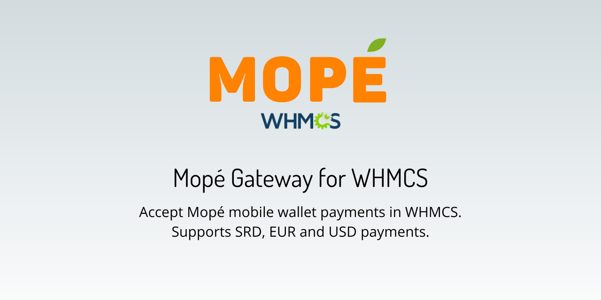
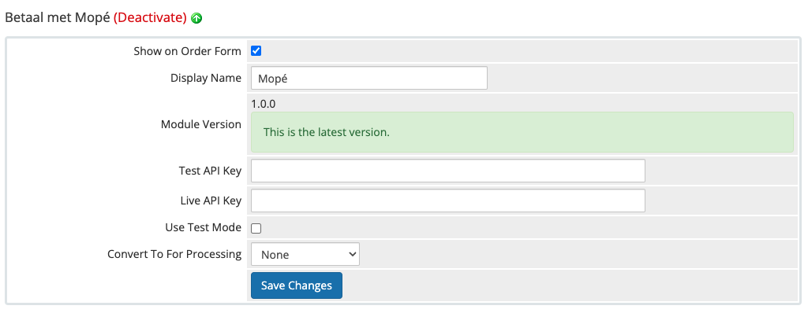

<h1>Mopé Gateway voor WHMCS</h1>

Mopé Gateway voor WHMCS biedt de mogelijkheid om **betalingen via de Mopé mobile app in WHMCS te ontvangen**. Om deze payment gateway te gebruiken moet je contact opnemen met Hakrinbank om de Mopé online overeenkomst te tekenen. Meer informatie over Mopé vind je op: https://mope.sr/

## Ondersteunde WHMCS Versies
Momenteel ondersteunt deze betaalgateway de volgende versies van WHMCS:

* 8.x

## Features
* Ontvang betalingen in SRD, EUR en USD van Mopé mobile wallet users.

## Installatie
Om de Mopé module in WHMCS te installeren, download en unzip de module bestanden, gevolgd door het uploaden van de bestanden naar je WHMCS installatie als volgt:

1. Kopieer vanuit de rootmap van de module het bestand `mope.php` en plaats dit in de map `/modules/gateways/` van je WHMCS installatie.
2. Kopieer vanuit de map `callback/` in de modulemap het andere `mope.php` bestand en plaats dit in de map `/modules/gateways/callback` van je WHMCS installatie.
3. Kopieer de map `mope/` vanuit de modulemap naar de map `/modules/gateways/` van je WHMCS installatie.

## Setup
Om de Mopé module in WHMCS te activeren, ga naar **Configuration () > System Settings > Payment Gateways > Visit Apps & Integrations** en zoek naar Mopé, of, vanaf WHMCS 8.6, **Setup > Payments > Payment Gateways** en kies Mopé uit het tabblad “All Payment Gateways”.

Eenmaal geactiveerd, moet je je inloggegevens invoeren in de daarvoor bestemde vakken, zoals hieronder getoond.

In het vak **Display Name**, pas de naam aan naar iets vriendelijkers zoals “Mopé”.

In de vakken **Test API Key** en **Live API Key**, voer de API sleutels in die je van het Mopé team hebt ontvangen. Als je de test mode wilt gebruiken, zorg dan dat je een Test API Key hebt ingevoerd.

## Features

| Type             | One Time Payments    | Recurring Payments      | Refunds        |
|------------------|----------------------|-------------------------|----------------|
| Mopé App Betaling| Ja                   | Nee                     | Nee            |

## Updates
Updates van de gateway worden indien nodig uitgebracht, inclusief nieuwe functies, bugfixes en beveiligingsverbeteringen.

## Veelgestelde Vragen

Kan ik deze gateway kopiëren, aanpassen of redistribueren?

 Ja, deze module is open source en MIT gelicenseerd, zodat je deze gateway naar wens mag kopiëren, aanpassen of redistribueren.

Is Mopé beschikbaar in alle landen?

 Nee, momenteel is Mopé alleen voor users in Suriname en Nederland beschikbaar.

Mag ik bijdragen aan de ontwikkeling van deze gateway?

Natuurlijk, dat kan zeker. Wij staan open voor pull requests, maar open aub eerst een issue om de voorgestelde wijzigingen uit te leggen.

